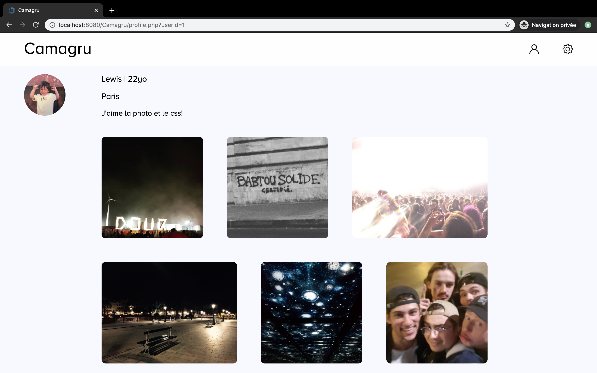
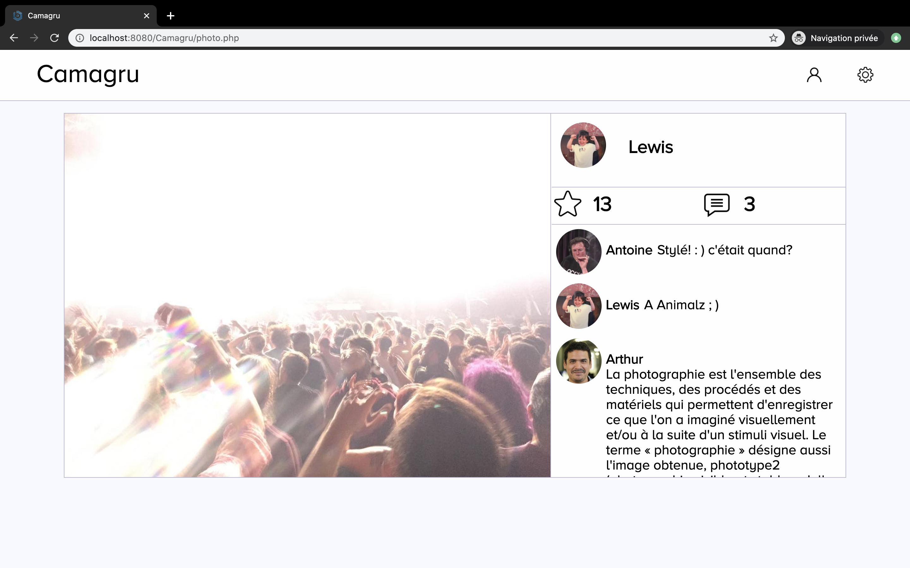
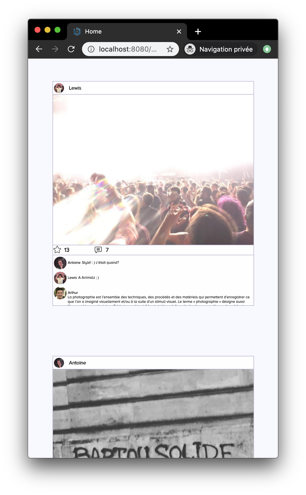
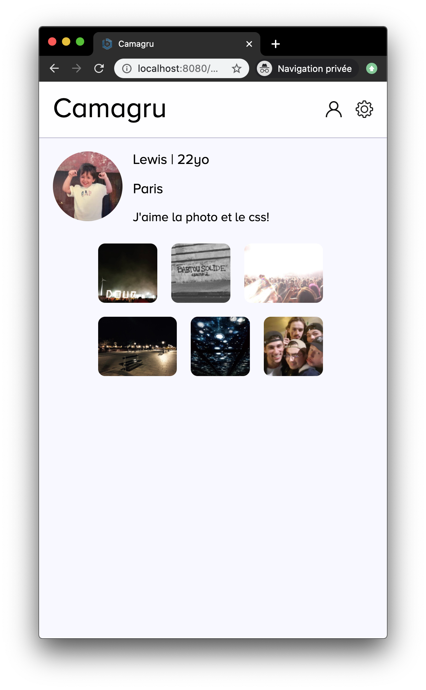

# Camagru

L'objectif est de réaliser un site assez proche d'instagram, c'est à dire une plateforme de pubication et de partage de photos ainsi que d'échange autour de celles-ci.

J'ai commencé ce projet juste après la "**Piscine Web**" de l'école 42, une formation accélérée de deux semaines en **HTML**, **CSS**, **PHP** et **Mysql**. Le sujet me limitait à ces technologies et au **JavaScript**. Il a donc fallu approfondir les bases acquises pendant la piscine et prendre en main le **Javascript** à peine survolé jusqu'ici.

Je me suis d'abord penché sur le **front**. J'ai alors travaillé à rendre le site aussi beau et ergonomique que possible avec les outils et le temps dont je disposais. Je me suis appliqué à élaborer une organisation intuitive et un rendu agréable.

Hélas, j'ai assez vite été contraint de retourner à la programmation en **C** pour terminer mon cursus à l'école 42 dans les temps, le projet est donc inachevé pour l'instant.

  

  

 
